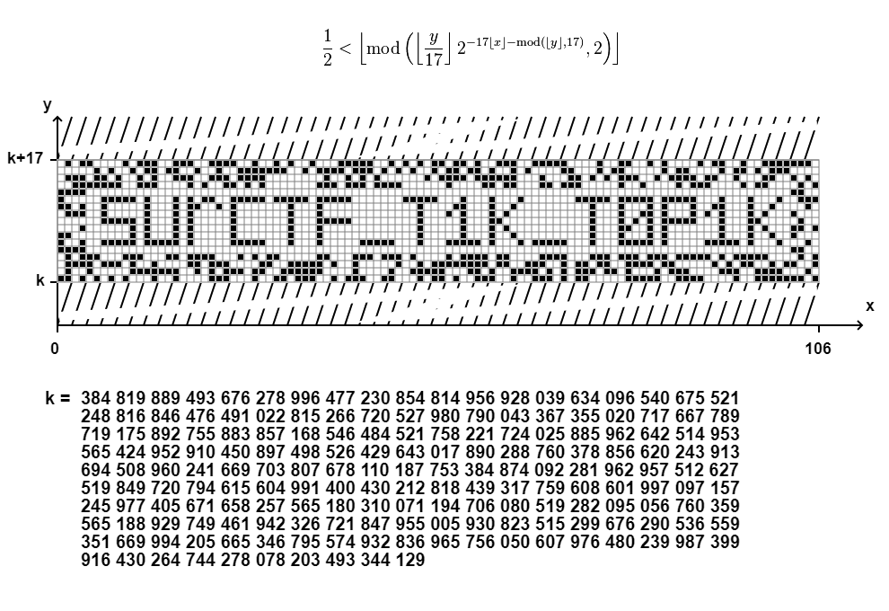

В тексте задания намекалось на какую-то формулу, говорилось что эта формула может всё. 

Если чуть погуглить: `формула может всё`, `формула всего`. 

То можного было бы наткнуться на [формулу Таппера](https://ru.wikipedia.org/wiki/%D0%A4%D0%BE%D1%80%D0%BC%D1%83%D0%BB%D0%B0_%D0%A2%D0%B0%D0%BF%D0%BF%D0%B5%D1%80%D0%B0), если хотите узнать про нее подробнее есть прикольное [видео](https://www.youtube.com/watch?v=_LXrtnYKPVc&ab_channel=positronium).

В интернете можно найти тулзы для рисования этой формулы ([например](https://tuppers-formula.ovh/))

Преобразуем, получаем флаг, радуемся!

`flag: surctf_t1k_t0p1k`