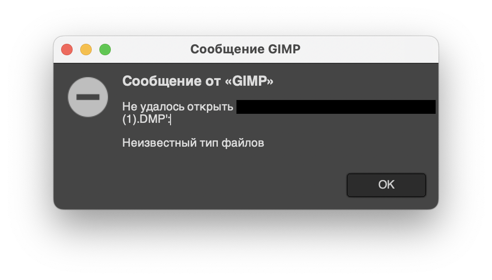
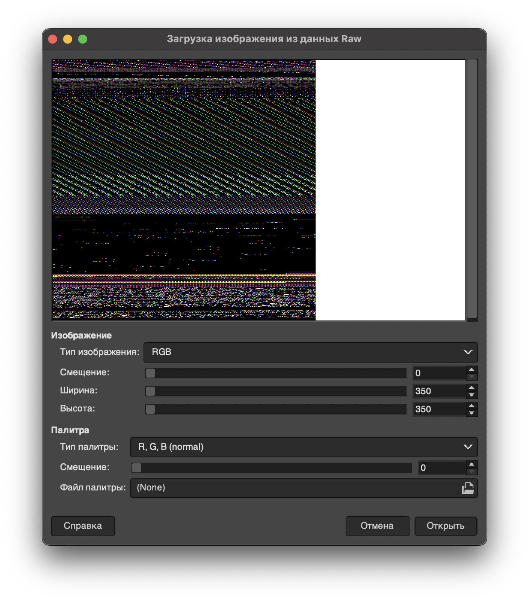
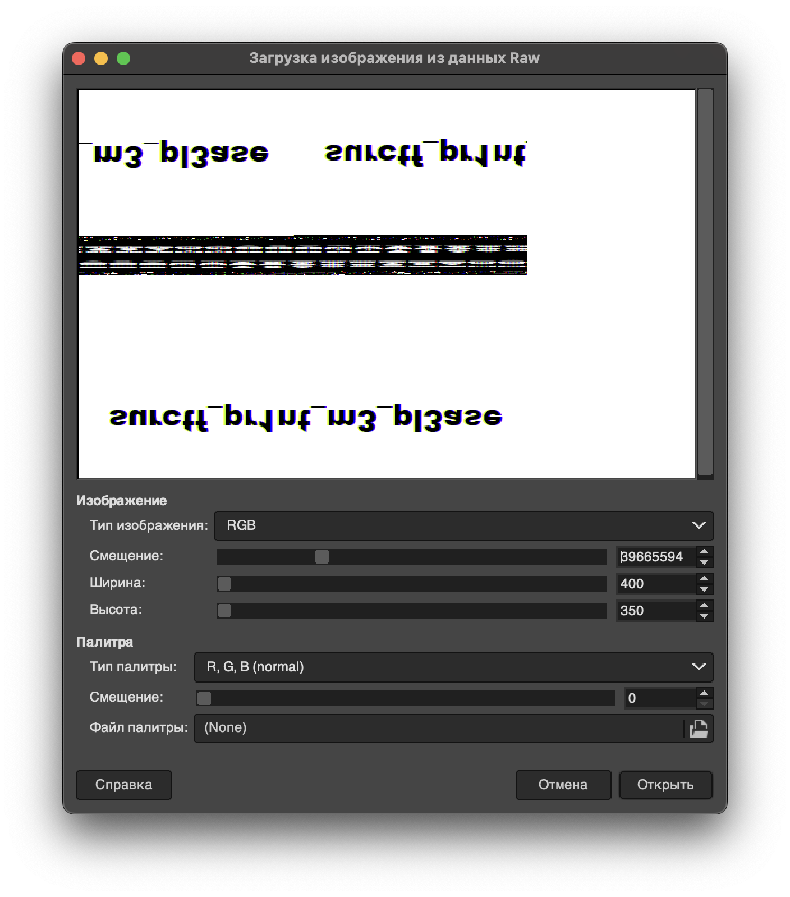

В руки мы получаем дамп процесса пэинта, нам нужно вытащить от туда изображение, но как? 

Попробуем немного погуглить и узнаем, что оперативная память хранит изображение в сыром виде, остается только воспользоваться приложением, которое может превращать этот сырой вид в картинку. 

На выбор есть два приложения, [GBS](https://github.com/old-games/GBS) и [GIMP](https://www.gimp.org/). 

Мне больше нравится использовать [GIMP](https://www.gimp.org/), он быстрее работает с большими файлами, также работу с ним можно автоматизировать. 

Попробуем, загрузить туда наш файл, для начала к нему нужно добавить приписку `.data`, чтобы [GIMP](https://www.gimp.org/) захотел его кушать. 

Мы видим окошко и много разных пикселей, не похоже на изображение, попробуем покрутить ползунки. В частности смещение и ширину.

А вот и наше изображение, правда оно перевернуто, ну ничего, прочитать его можно и так. 

`flag: surctf_pr1nt_m3_pl3ase`
