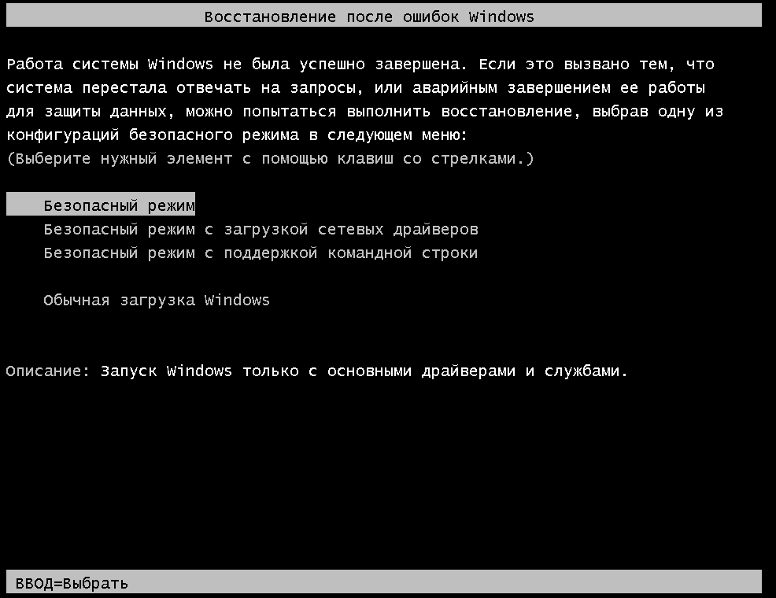
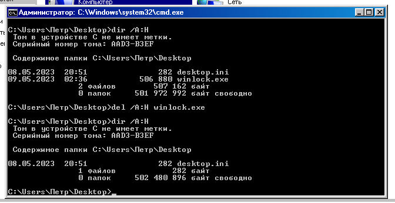
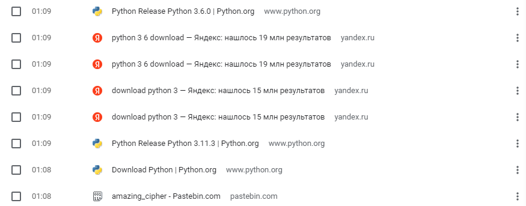
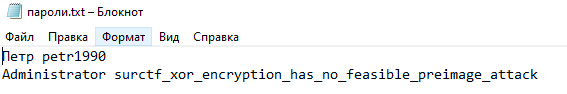

# Идеальное преступление 2
После успешного входа в аккаунт Петра нас встречает окно винлокера, которое можно легко обойти просто загрузившись в безопасном режиме и удалив исполняем файл винлокера.

Грузимся в безопасный режим:  
  

И тут в принципе можем продолжать решать таску, но комфортнее будет удалить винлокер и загрузиться в обычном режиме. Так как винлокер умный, он себя скрыл и чтобы его найти надо либо в настройках винды включить отображение скрытых файлов, либо искать файл через CMD с помощью команды dir с атрибутом `/A:H`, который покажет нам все скрытые файлы.(удалять нужно тоже с атрибутом `/A:H`) Я воспользовался вторым вариантом, файл лежал на рабочем столе:  
  
После удаления файла, перегружаем в обычный режим и радуемся.  

Вспоминаем условие задания, видим на рабочем столе файл `важное.zip.enc`, думаем как же его расшифровать. Предположив, что, для того чтобы зашифровать файл, атакующий должен был сначала загрузить шифратор пытаемся найти следы загрузки на компе.  
В истории браузера находим вот такие вот записи:  
  
Понимаем, что файл был зашифрован скриптом с pastebin'a.
Скачиваем скрипт, а там вот такое:  
```python3
import random
 
random.seed(1337)
 
def r(a, b):
    return random.choice([i for i in range(random.choice([i for i in range(a, b//2)]), random.choice([i for i in range(a+b//2, b)]))])
 
random.randint=r
 
key = "1_am_the_b3st_h4ck3r_hah4ha_you_neVer_h4ck_this_c1ph3r"
 
file = input("FILE: ")
 
with open(file, "rb") as f:
    data = f.read()
 
enc_data = []
for i, b in enumerate(data):
    enc_data.append(b ^ ord(key[i % len(key)]))
    if i % 2 == 0:
        enc_data.append(b ^ random.randint(1, 256) ^ b)
 
with open(file + ".enc", "wb") as f:
    f.write(bytes(enc_data))
```

Здесь видим несколько интересных вещей:  
1. Функция random.randint переназначено функцией r:
```python3
    def r(a, b):
      return random.choice([i for i in range(random.choice([i for i in range(a, b//2)]), random.choice([i for i in range(a+b//2, b)]))])

    random.randint=r
```
2. Шифрование происходит в цикле, где каждый символ исходных данных ксорится(XOR) с символом из ключа, циклично, причём если индекс символа четный, то добавляется еще символ ксорнутый со случайным символом генерируемым с помощью функции random.randint(т.е. r):  
```python3
enc_data = []
for i, b in enumerate(data):
    enc_data.append(b ^ ord(key[i % len(key)]))
    if i % 2 == 0:
        enc_data.append(b ^ random.randint(1, 256) ^ b)
```  
Думаем, как же нам расшифровать файл, если при шифровании используются случайные числа. Думаем. Думаем. Понимаем, что, по факту, каждый раз когда индекс символа четный, алгоритм просто добавляет один мусорный символ и нам достаточно его отбросить, а дальше очищенные от мусора данные еще раз проксорить с ключом(вспоминаем свойства операции XOR, a XOR b = c, c XOR b = a).
Пишем скрипт дешифратора:
```python3
key = "1_am_the_b3st_h4ck3r_hah4ha_you_neVer_h4ck_this_c1ph3r"

with open("важное.zip.enc", "rb") as f:
    data = f.read()

# Генерируем маску по которой будем отбрасывать мусор
mask = []
for i in range(len(data)):
    mask.append(1)
    if i % 2 == 0:
        mask.append(0)

    if len(mask) >= len(data):
        break

# Отбрасываем мусор с помощью маски
filtered_data = []
for i in range(len(data)):
    if mask[i] == 0:
        continue
    filtered_data.append(data[i])

# Декодируем
dec_data = []
for i, b in enumerate(filtered_data):
    dec_data.append(b ^ ord(key[i % len(key)]))

with open("dec.zip", "wb") as f:
    f.write(bytes(dec_data))
```

Расшифровав получаем исходных архив, открываем его, видим там папку `важное`, открываем, а там, в файле `пароли.txt`, нас ждет флаг:  



`flag: surctf_xor_encryption_has_no_feasible_preimage_attack`
