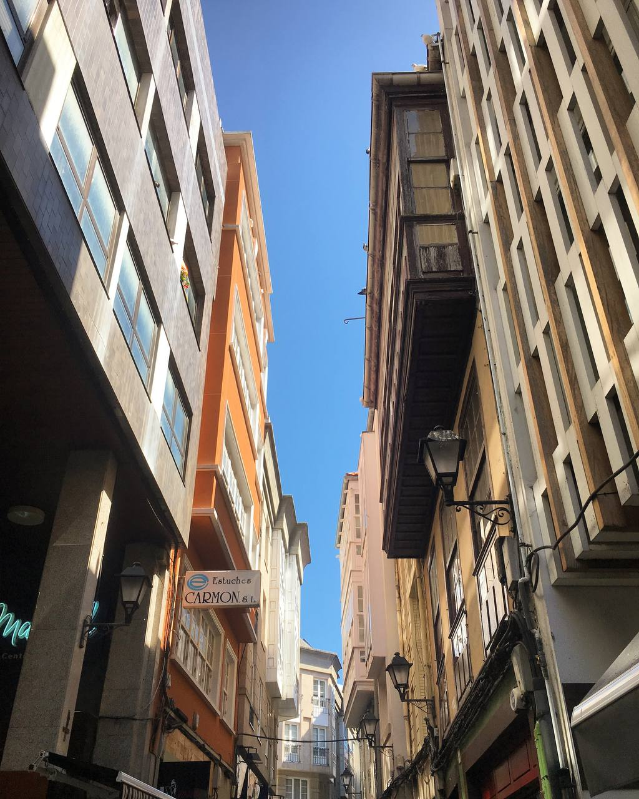
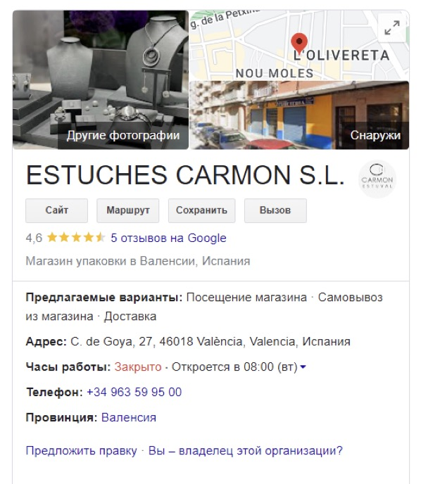
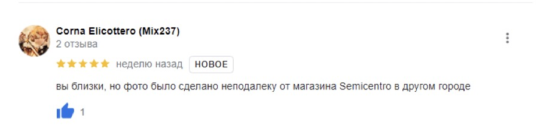
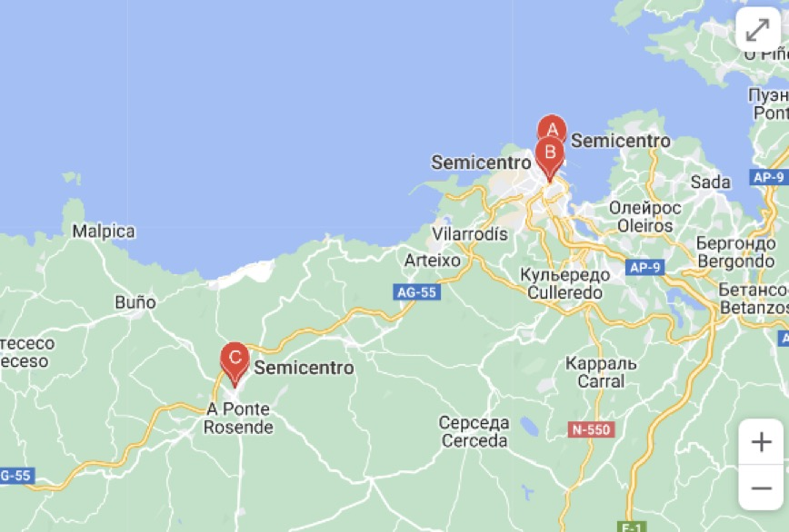
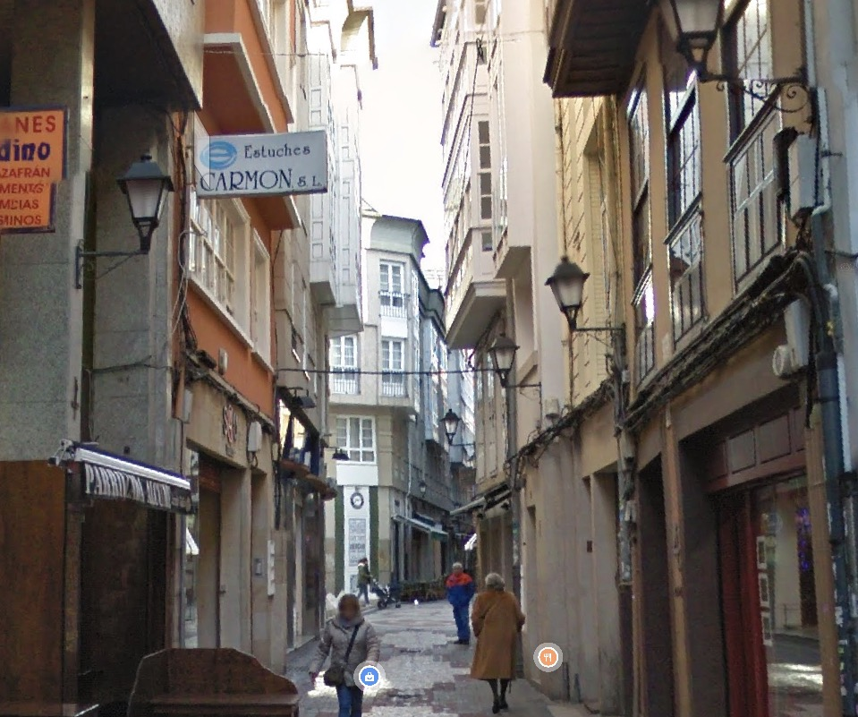

1. Ищем этот ник `Zzledinsi` в различных соцсетях через какого-нибудь бота ([например](https://github.com/soxoj/maigret)).

2. В результате поиска выдает [ссылку на профиль](https://vsco.co/Zzledinsi/gallery) в vsco.

3. Видим одну единственную фотографию.

4. На фотографии видно надпись `ESTUCHES CARMON S.L.`. Гуглим ее.

5. Видно, что фото сделано не здесь, заходим в отзывы об этом месте.

6. Гуглим `semicentro spain`. Всего в Испании 3 магазина с таким название, ищем похожие места на карте.

7. Находим по адресу `48 Rúa Galera` то самое место с фотографии

`flag: surctf_trav3l_1n_spa1in`