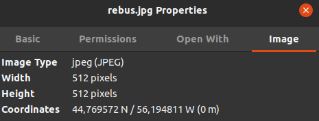
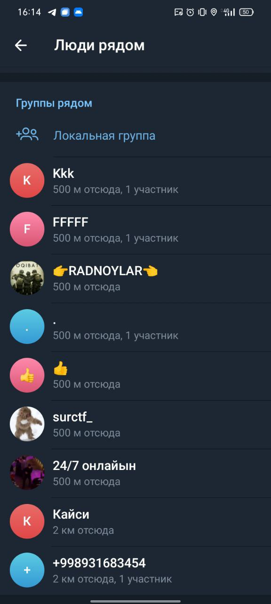
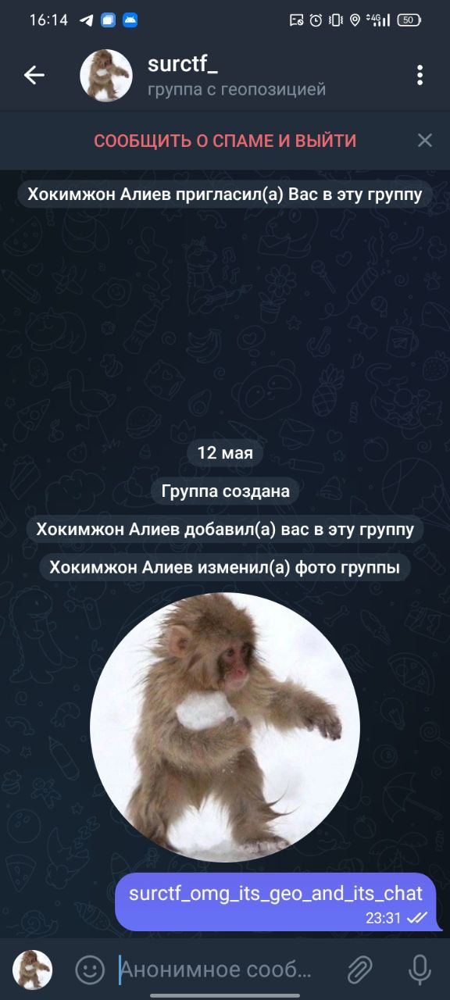

# rebus
Видим картинку:  

Долго думаем что же она может значить:
  1. Самолетик - телеграм
  2. Лупа на карте - что-то с поиском по геопозиции или типа того
  3. Два общающихся челика - чат

Думаем думаем, как же это связать. Вспоминаем(или узнаем) про геочаты в телеграм, осталось понять где этот гео чат искать.  
На площадке чатов не находим. Пробуем заглянуть в метаданные картинки, находим там координаты:  

Скачиваем любой подменщик геолокации на телефон(например fakegps), вбиваем эти координаты, заходим в телеграм тыкаем на "люди рядом" и видим интересную группу с названием "surctf_", заходим, а там флаг:  

  

`flag: surctf_omg_its_geo_and_its_chat`
