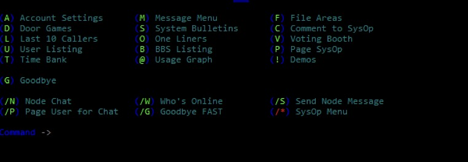
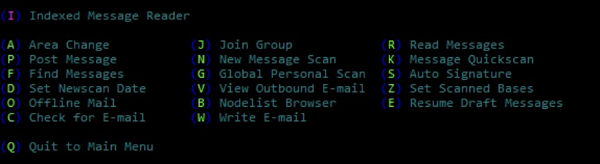
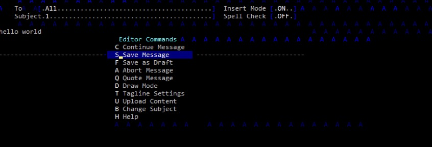
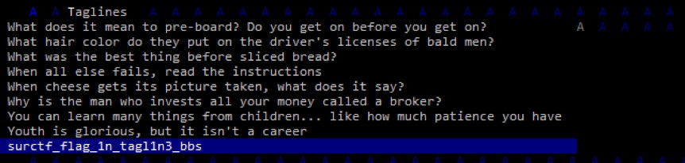

1. C помощью команды `telnet` подключаемся по ip адресу.

2. Регистрируемся и переходим в Message Menu.

3. Затем в Post Message, пишем свое сообщение, сохраняем.

4. Перед отправкой есть возможность выбрать tagline, в самом последнем tagline скрывается флаг.

`flag: surctf_flag_1n_tagl1n3_bbs`