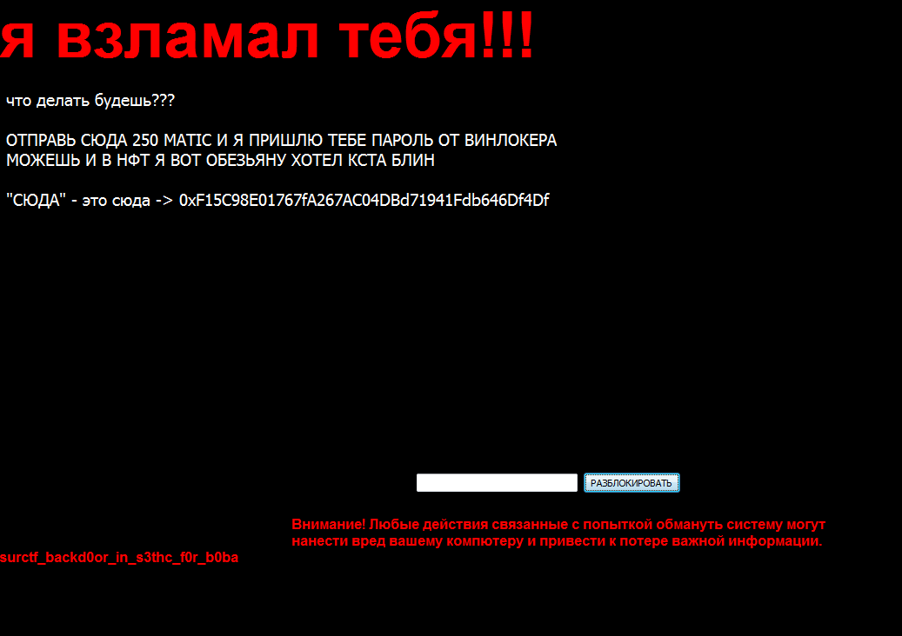

# Идеальное преступление 3
Последним заданием в трилогии стал поиск информации об атакующем. Тут можно прочесать весь компьютер и не найти ничего, просто потому что единственный весомый след мы удалили вместе с винлокером.  
Этим следом был крипто кошелек атакующего. Возвращаемся к окну винлокера:  
  
Видим тут что нас просят перевести MATIC на кошелек `0xF15C98E01767fA267AC04DBd71941Fdb646Df4Df`. MATIC это валюта сети Polygon.  
Заходим на [polygonscan.com](https://polygonscan.com), вбиваем туда кошелек и ищем какие-нибудь интересные транзакции. Оказывается что транзакция всего одна, и это NFT с OpenSea:  

Заходим на OpenSea, вбиваем кошелек атакующего, и видим целую коллекцию NFT на аккаунте:  
  
Дальше пытаемся найти что-то по этим картинкам, или прямо в них. И в картинке NFT `ahahah` находим вот такую запись:  
  
Важно: картинку нужно было скачивать не в **.avif** формате, а в **.jpg**, тыкнув на кнопку `View origin media` в правом верхнем углу.

`flag: surctf_hahaha_blockchain_is_chain_of_blocks`
