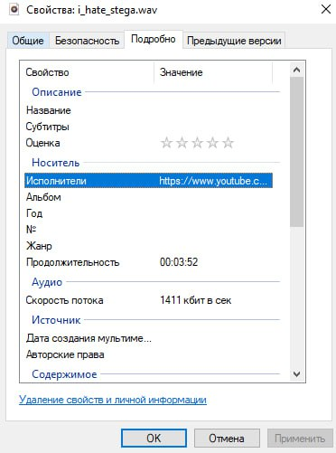
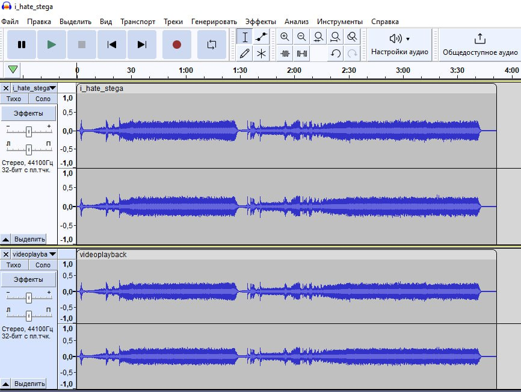
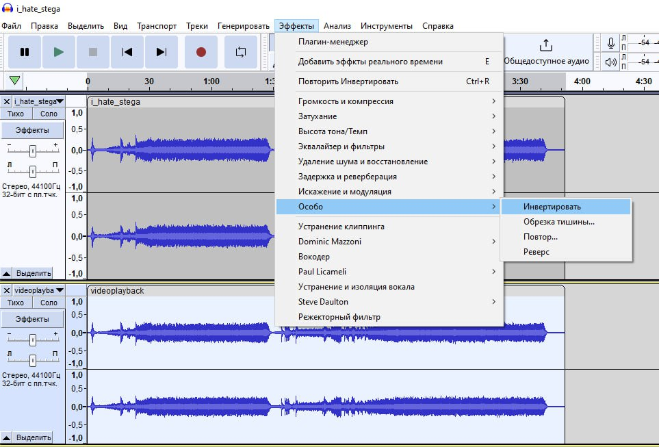
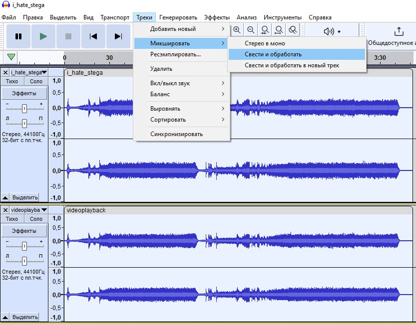
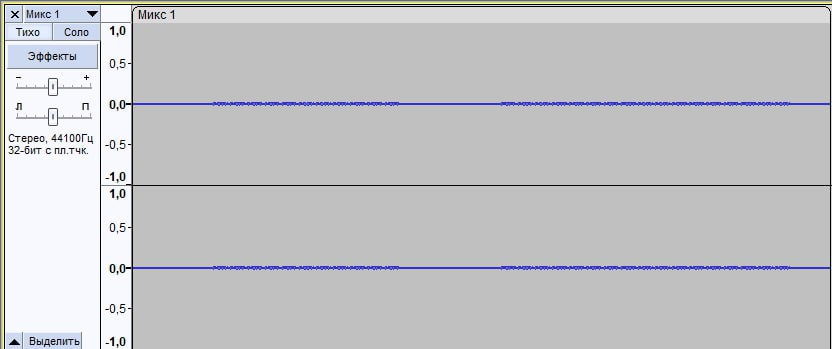

# i_hate_stega
Скачиваем wav файлик, слышим легендарную даруде сэндсторм(если достаточно внимательны, то слышим еще небольшие искажения). Пытаемся понять че как тут что, в метаданных обнаруживаем ссылку на ютуб:  
  
Ссылка введет на видеоклип под эту песню, скачиваем его с помощью ssyoutube.com(можно просто к оригинальной ссылке добавить два символа 'ss') и закидываем оба файла(оригинал и из таска) в audacity.  
  
Для того, чтобы получиь разницу двух звуковых файлов в audacity нужно сделать два действия:
  1. Инвертировать одну из дорожек, например, оригинальную:  
    
  2. Свести две дорожки:  
  

В итоге получим оставшуюся разницу, так-как инвертированные волны из оргинала погасят себя в модифицированной версии, и останется только подмешенная информация:  
  
Слушаем, что осталось, слышим флаг.  
`flag: surctf_oh_my_god_stega_is_so_cool_i_hate_stega`
