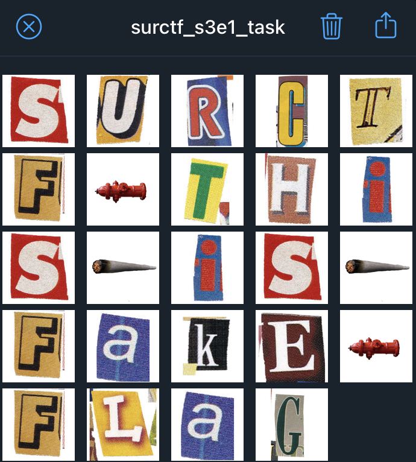
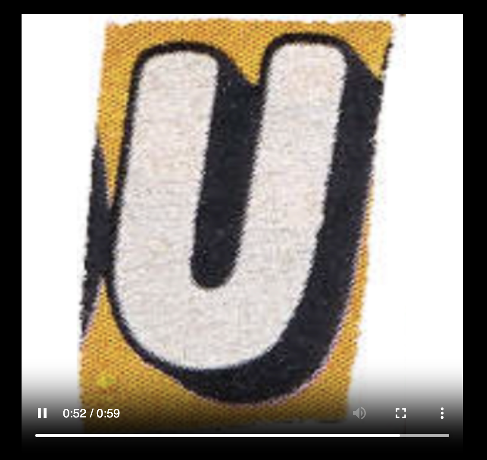
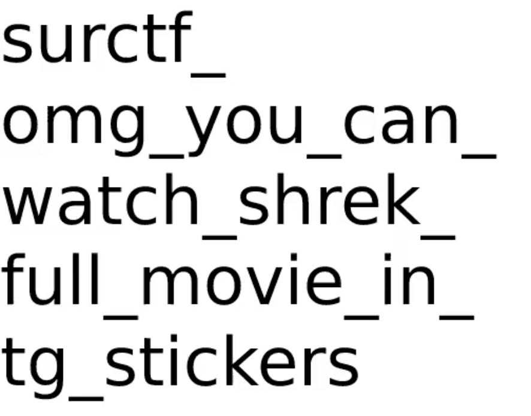

# surctf_stick
Открываем стикерпак, видим флаг:  
  
Переписываем его(`surctf_this_is_fake_flag`), сдаем, понимаем что не сдаем, понимаем что это фейковый флаг.
Думаем дальше, пробуем скачать какой-нибудь стикер(пкм из десктопной верссии -> save as). Видим что скачался webm файлик. Закидываем в любой брауезер, чтобы воспроизвести и нифига себе, видим, что это видео а не просто картинка, так еще и таймер постоянно увеличивается, жесть.  
  
Дальше, либо долго смотрим видео(4 минуты), либо закидываем в любой онлайн сервис(https://products.aspose.app/video/splitter/webm), который делит webm на кадры и смотрим последний кадр. Получаем:  

`flag: surctf_omg_you_can_watch_shrek_full_movie_in_tg_stickers`
