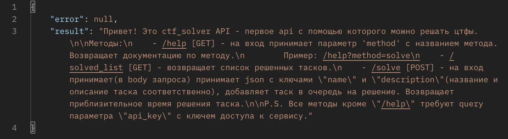
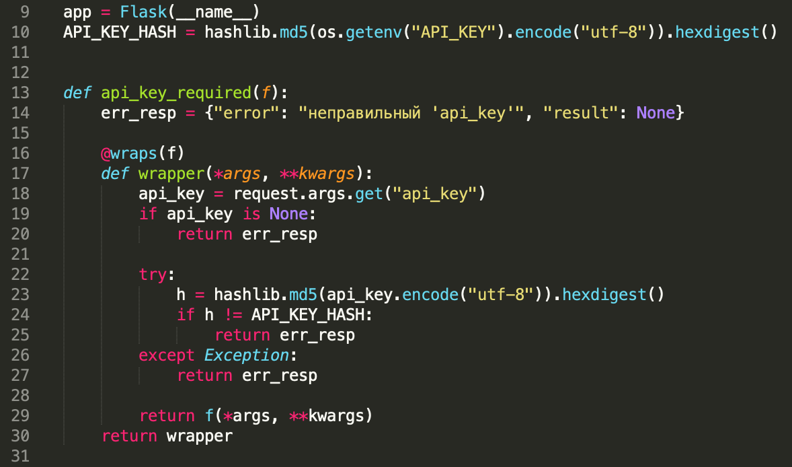
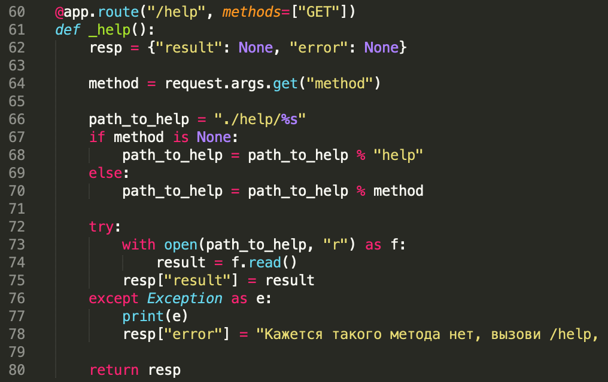
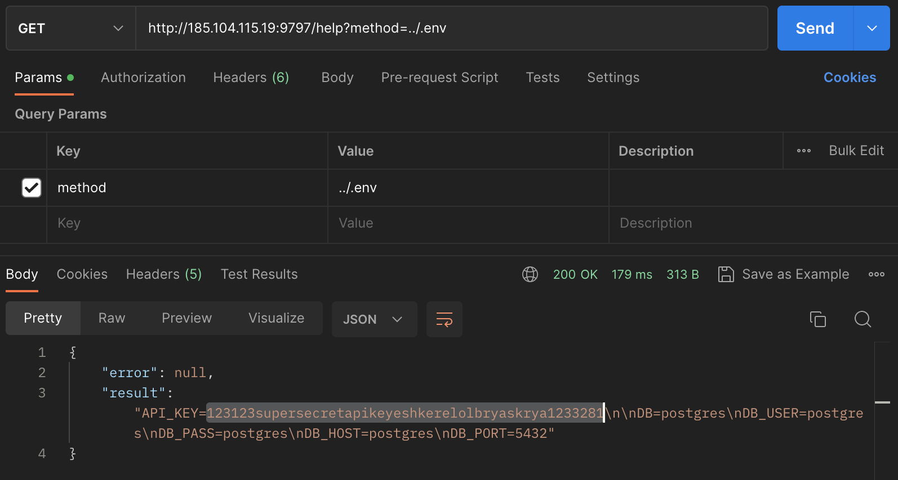
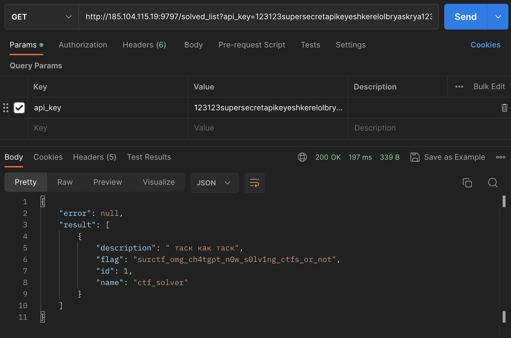

# ctf_solver
Делаем запрос к сервису, видим вот такое:  
  
Читаем, понимаем что все методы кроме /help требуют api_key, которого у нас нет.

В коде видим, что переменные окружения считываются из .env файла('load_dotenv()'), после чего из них берется значение API_KEY, от кторого вычисляется md5 хэш, который потом используется для проверки полученного от клиента api_key'я(23я строка):  
  

Обращаем внимание на то, как работает метод /help. Документацию к каждому методу он берет из файла, название которого напрямую берет из query параметра "method", никак не валидируя(73 строка):  

Понимаем, что это path traversal и легко эксплуатируем с помощью такого запроса(в переменную метод вписываем значение "../.env", чтобы считытать файл с переменными окружения(с апи кеем), на директорию выше):  
  
Получаем наш API_KEY(`123123supersecretapikeyeshkerelolbryaskrya1233281`), отправляем запрос на solved_list, получаем флаг:  
  

`flag: surctf_omg_ch4tgpt_n0w_s0lv1ng_ctfs_or_not`

