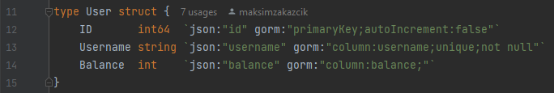

# godra_1
Читаем исходники, обращаем внимание на хэндлер создание юзера:  
  
Видим, что на 29й строке происходит анмаршалинг json'а из тела запроса в структуру юзера, далее валидируется только юзернейм и запись сразу добавляется в БД(41я строка). Гугли как работает анрмашалинг в Go Например [тут](https://gobyexample.com/json), узнаем про то, что считываются поля с помощью тэгов структуры.  
Смотрим как выглядит структура User:  
  
Видим, что у структуры есть поле balance с тэгом `json:"balance"`, т.е. при анмаршалинге берется значение по ключу "balance".
Так как это значение никак не валидируется, то при регистрации мы можем добавить это поле в тело запроса и зарегаться с определенным балансом.

Смотрим как происходит рега:  
  
Делаем post запрос на /user, с initData и в теле отправляем что-то типа `{"username": "boychik1337", "balance": 99999}` и регаемся сразу с балансом.  
Покупаем слитый флаг в магазине и сдаем в борду.  
`flag: surctf_omg_surctf_n0w_p2win`
